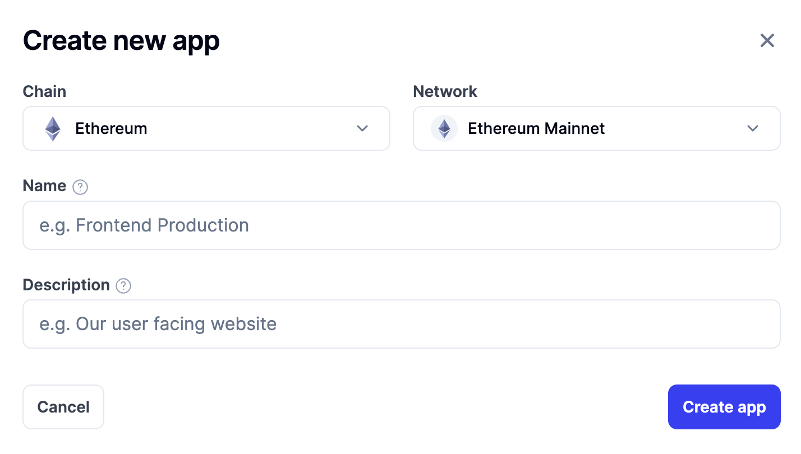
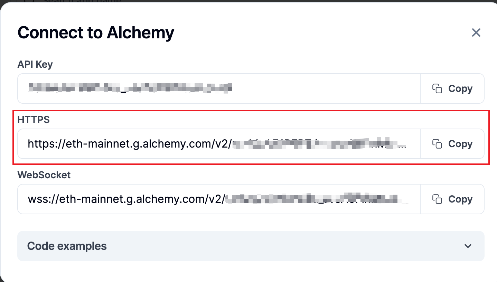

# flt-withdraw

flt tokens 提取

## 创建Alchemy API Key

通过这个教程可以学习[如何创建Alchemy API Key](https://github.com/XdpCs/Solidity-learning/tree/master/Tools/001.Alchemy)

记得在点击`Create new app`后，Chain选择`Ethereum`，Network选择`Ethereum Mainnet`。



## 配置config.json

选择下图中红框框出的，复制并填写到`config.json`中的`http_rpc`字段中。



```json
{
  "http_rpc": "your rpc"
}
```

